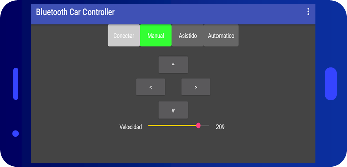
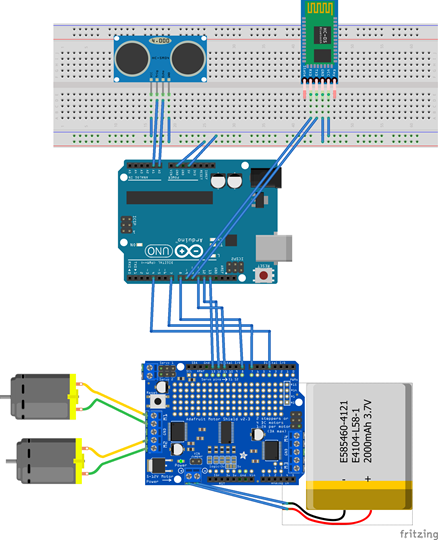
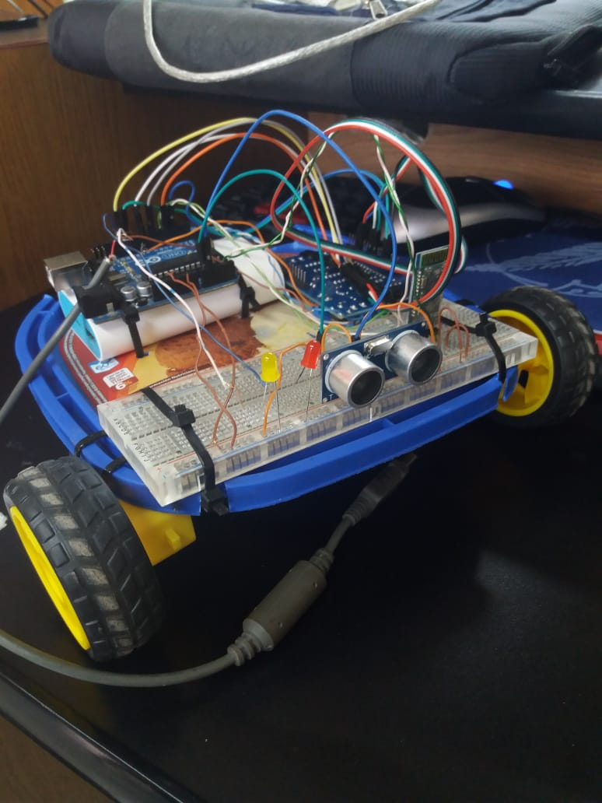

# Embedded Systems final project: Android SmartCar

## Team:
* Landau, Nicolas.
* Puhl, Juan Manuel.

## Description

The objective of this project was to create a tiny car, like the one we used to play when we were little, but controlled via bluetooth using an Android smartphone and programmed on an Arduino UNO.
The car also has a proximity sensor, which is used to detect collisions in our way and automatically stop or deviate and find a safe path.  
There are three modes: Manual, Assisted and Automatic.  
In **Manual Mode**, the user will have full control of the car, allowing him to crash it against all objects he sees necesary.  
The **Assisted Mode** works as the manual, but the car can detect collisions ahead, and will automatically stop when there is an object in front of it, without letting the user go forward.   
The last one, the **Automatic Mode**, the car will be driving itself. When an inminent collision is detected, the car will go to the right until there is nothing ahead, then it will continue going forward.

## Components used
* Arduino UNO.
* DC Motor 6V 100RPM + Wheels x 2.
* Motor Shield L293D.
* Ultrasonic Sensor HC-SR04.
* Bluetooth Module HC-05.
* Android Smartphone.
* Leds.

## Android App

For the implementation of the app, we used [MIT AppInventor](https://appinventor.mit.edu), a web app which let us design and program our aplication easily and quickly. 
There are command blocks which provide different variables and methods. All we have to do is assemble the blocks we needed and design the app.
The .apk and the .aia files can be found in the *"Android App"* folder. (.aia is the file format used by MIT AppInventor to save/load projects to/from the PC).

## Arduino App

For the implementation of the Arduino code, we used some external libraries, like AFMotor from Adafruit, to control the motor shield and thus the DC motors. Also, we used the Software Serial library, to configure the bluetooth module and the communication with the smartphone.
The code can be found in the *"Arduino App"* folder.

The packet used in the communication is as follows:
* Initial Char : *"#"*.
* Mode:
  - 0 : Manual Mode.
  - 1 : Assistance Mode.
  - 2 : Automatic Mode.
* Direction:
  - 0 : Don't move.
  - 1 : Forward.
  - 2 : Backward.
  - 3 : Left.
  - 4 : Right.
* Speed : 0 - 255.
* Ending Char : *"@"*.
* Escape Char : *" \ "*.

## Components connection

## Limitations

The main limitation is the control, we wanted to implement a control like the one used for the RC Cars, with two sticks. But due to lack of time, we decided to use a d-pad for the movement. Also, there were things we didn't expect when we first designed the car, like the limitations of the ultrasonic sensor. It can only detect objects that are perpendicular to the sensor, so, if an object surface is slightly rotated some few degrees, the sensor won't detect it. One solution to this problem is to include another sensor to detect objects in another angle, or use a servomotor with the sensor attached to it, and continuosly rotate it to detect collisions.

## Screenshots

